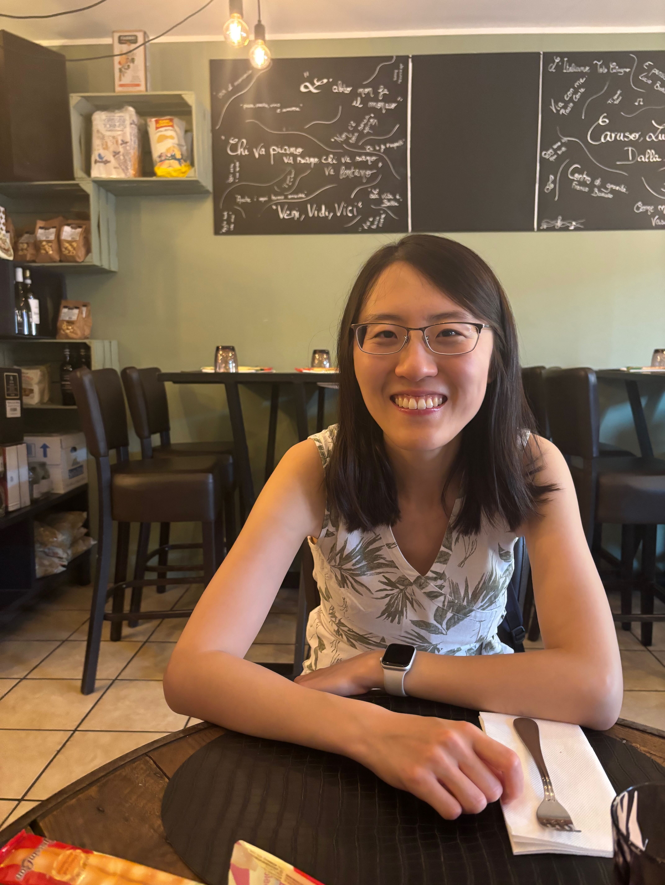

## Academic:
I am a postdoc at Oxford Statistics working 
with [Prof. Patrick Rebeschini](https://www.stats.ox.ac.uk/~rebeschi/). My research focuses on **machine learning theory** and **statistical learning**, with particular emphasis on heterogeneous data settings. I have recently been working on two main problems: (i) designing and analysing algorithms for online learning where data arrives sequentially and evolves over time; (ii) I study the training dynamics of popular machine learning architectures such as neural networks and attention mechanisms, particularly how they behave under challenging conditions like distribution shift and contamination. I am especially interested in understanding phenomena such as benign overfitting, early stopping, and in-context learning in these heterogeneous data settings.

I completed my PhD at Cambridge in 2024, where I was fortunate to be advised by [Prof. Ramji Venkataramanan](https://rv285.github.io/). My PhD work centered on **information theory** and **statistical learning**, motivated by fundamental questions such as: Given a complex statistical estimation problem, what is the  minimal amount of data we need to estimate the underlying signal? Can we design efficient, mathematically-principled algorithms that approach the minimum? 

Prior to my PhD, I obtained my BA and MEng with distinction in Information and Computer Engineering from Cambridge in 2019. 

I was an intern with 
**Microsoft Research Cambridge** in 2023, where I worked on error correction codes for Project Silica, a novel long-term data storage technology based on quartz glass. This technology uses lasers to encode data onto small glass discs by creating nanoscale gratings that represent binary information, which can then be read using optical methods and machine learning algorithms.

## Personal:
My first name is pronounced as "Sh-ih-ow Chi" (meaning jade born at dawn in Chinese), but feel free to call me Shirley!

Having lived and worked across four cultures (Chinese, British, Singaporean, and American) over the past decade, I have developed strong adaptability and open-mindedness. I am naturally curious about people from different cultural backgrounds and enjoy learning from their diverse experiences and perspectives. While I am introverted by nature, I have a warm personality and deep sense of empathy. Through leadership roles such as postgraduate representative, I work to bring people together and foster meaningful connections within my community.

Besides work, I like yoga and running.

## Get in touch:
I am actively seeking collaborators on learning theory, and statistical learning. Please send me an email if you are interested in working together!\
**Email**: shirley.liu [at] stats.ox.ac.uk, xiaoqi.shirley.liu [at] gmail.com