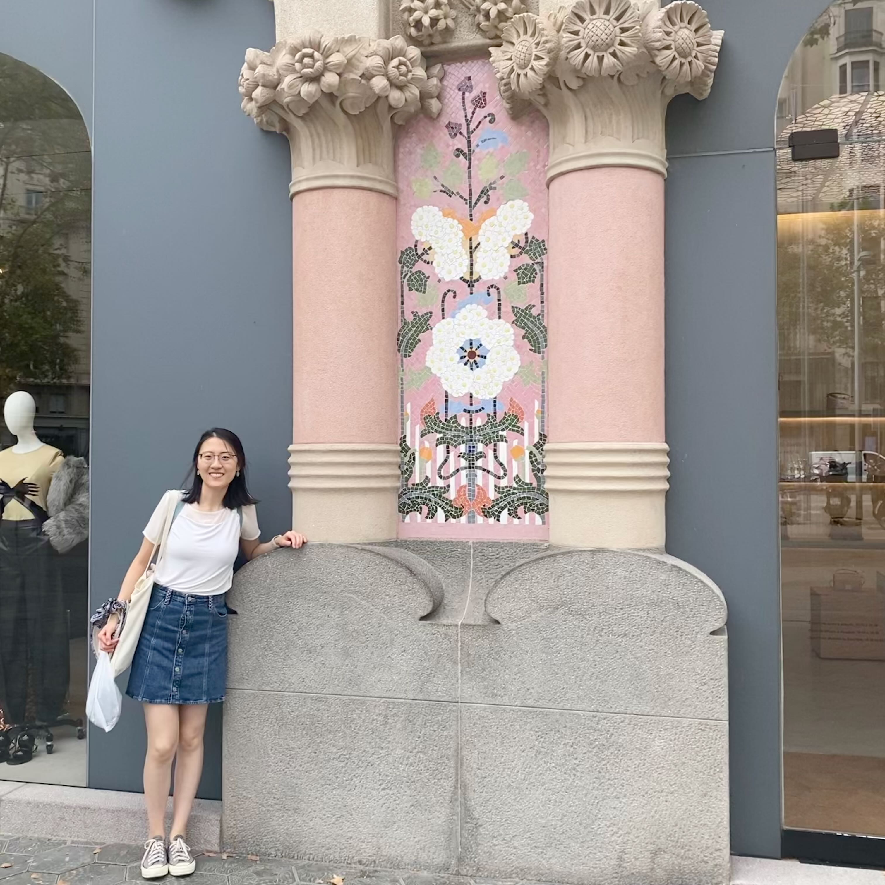

## Academic:
I am a final-year [PhD student](http://www.eng.cam.ac.uk/profiles/xl394)  at the University of Cambridge working 
with [Professor Ramji Venkataramanan](https://rv285.github.io/).  I'm part of the [Signal Processing and Communications Group](https://sigproc.eng.cam.ac.uk/) in the [Information Engineering Division](http://www.eng.cam.ac.uk/research/academic-divisions/information-engineering) of the Engineering Department.  My PhD focuses on modern data science using **information theory** and **statistical learning**. My research is driven by a desire to answer questions like: given a complex statistical estimation problem, what is the  minimal amount of data we need to estimate the underlying signal? Can we design efficient, mathematically-principled algorithms attempting to approach the theoretical minimum? 

Prior to my PhD, I obtained my BA and MEng with distinction in Information and Computer Engineering from Cambridge in 2019. 

I was an intern with 
Microsoft Research Cambridge in spring 2023, working on error correction codes for [Project Silica](https://www.microsoft.com/en-us/research/project/project-silica/) which is a new type of long-term data storage technology using quartz glass. Using lasers, data is encoded onto small glass discs through the creation of nanoscale gratings. These gratings serve as representations of binary data and can be read through the utilization of light and machine learning algorithms.

I am on the job market this year. 

## Personal:
My first name is pronounced as "Sh-ih-ow Chi" (meaning jade born at dawn in Chinese), but  feel free to call me Shirley!

I have lived, studied and thrived in **four cultures** (Chinese, British, Singaporean and American). My experience living overseas over the past decade has nurtured my adaptability and open-mindedness. I am always curious to learn and understand more about people whose cultural backgrounds, experiences and perspectives are different from my own. Although I'm introverted, I have a warm personality and a strong sense of empathy; through my leadership roles (e.g. postgrad representative), I work to bring people together and foster connections within my community. 

Besides work, I'm a sports lover and a half-marathon runner.

## Get in touch:
**Email**: xl394 [at] cam.ac.uk\
**Office**: BN3-03