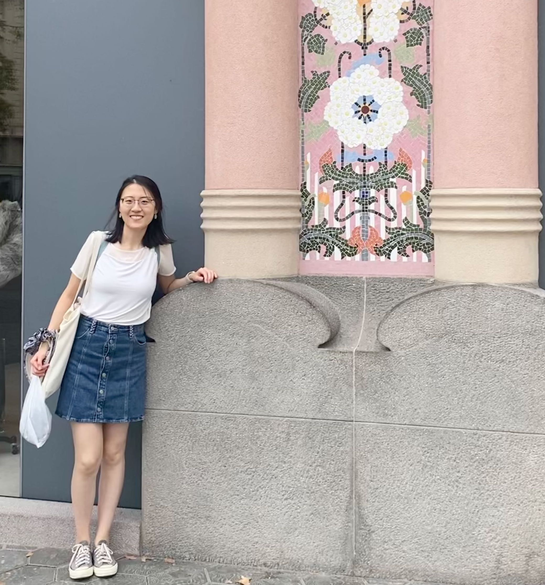

## Academic:
I am a postdoc at Oxford Statistics working 
with [Prof. Patrick Rebeschini](https://www.stats.ox.ac.uk/~rebeschi/).  I’m particularly interested in exploring online learning, and first-order methods (e.g., studying the training dynamics of simplified versions of popular ML architectures like neural networks and attention mechanisms under gradient descent).

I completed my PhD at Cambridge in 2024, where I was fortunate to be advised by [Prof Ramji Venkataramanan](https://rv285.github.io/). My PhD work focused on **information theory** and **statistical learning**, and was driven by a desire to answer questions like: given a complex statistical estimation problem, what is the  minimal amount of data we need to estimate the underlying signal? Can we design efficient, mathematically-principled algorithms attempting to approach the minimum? 

Prior to my PhD, I obtained my BA and MEng with distinction in Information and Computer Engineering from Cambridge in 2019. 

I was an intern with 
**Microsoft Research Cambridge** in spring 2023, working on error correction codes for [Project Silica](https://www.microsoft.com/en-us/research/project/project-silica/) which is a new type of long-term data storage technology using quartz glass. Using lasers, data is encoded onto small glass discs through the creation of nanoscale gratings. These gratings serve as representations of binary data and can be read through the utilization of light and machine learning algorithms.

## Personal:
My first name is pronounced as "Sh-ih-ow Chi" (meaning jade born at dawn in Chinese), but  feel free to call me Shirley!

I have lived, studied and thrived in **four cultures** (Chinese, British, Singaporean and American). My experience living overseas over the past decade has nurtured my adaptability and open-mindedness. I am always curious to learn and understand more about people whose cultural backgrounds, experiences and perspectives are different from my own. Although I'm introverted, I have a warm personality and a strong sense of empathy; through my leadership roles (e.g., postgrad representative), I work to bring people together and foster connections within my community. 

Besides work, I'm a sports lover and a half-marathon runner.

## Get in touch:
I am actively seeking collaborators on high-dimensional statistics, information theory and optimization. Please send me an email if you are interested in working together!\
**Email**: shirley.liu [at] stats.ox.ac.uk, shirleyliu50 [at] gmail.com