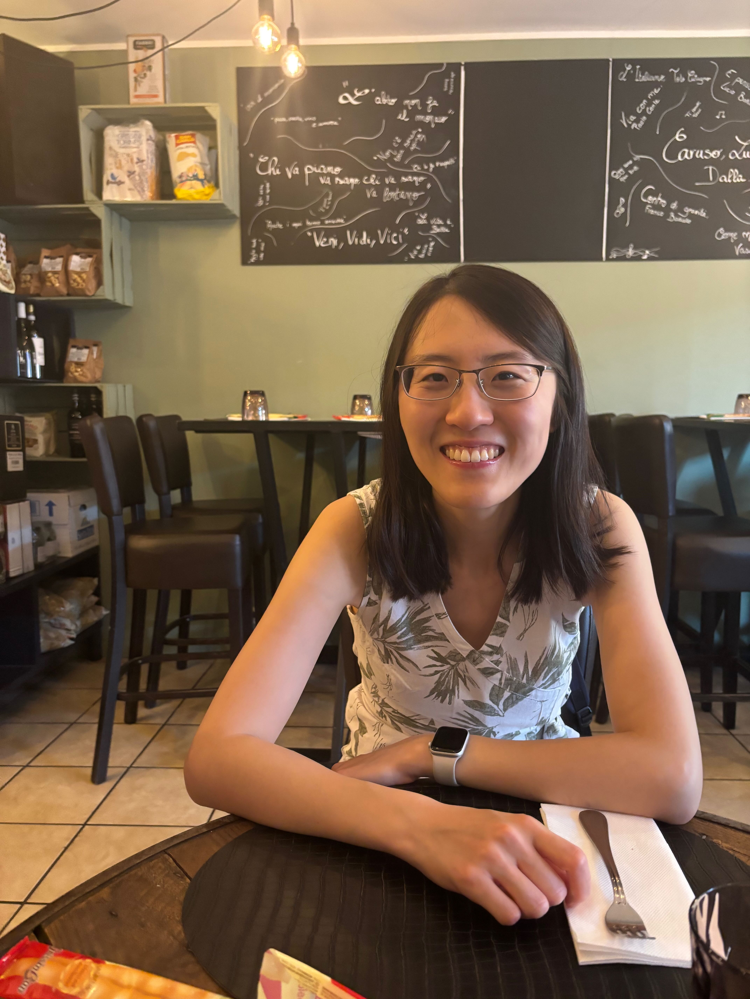

## Academic:
I am a postdoctoral researcher at Oxford Statistics working 
with [Prof. Patrick Rebeschini](https://www.stats.ox.ac.uk/~rebeschi/). My research focuses on learning theory and high-dimensional statistics, with particular emphasis on heterogeneous data settings. I believe in [Slow Science](http://slow-science.org/).

I have recently been working on three main problems: 
- Characterise **training dynamics** of canonical statistical and machine learning models, with a focus on understanding early stopping, benign overfitting, and feature learning
- **Sequential decision-making** under data heterogeneity with rigorous guarantees, including bandits and adaptive inference
- **Uncertainty quantification** using assumption-lean or distribution-free methods, including e-values, conformal prediction, and prediction-powered inference
 
I completed my PhD at Cambridge in 2024, where I was fortunate to be advised by [Prof. Ramji Venkataramanan](https://rv285.github.io/). My PhD work centered on information theory and high-dimensional statistics, motivated by fundamental questions such as: Given a complex statistical estimation problem, what is the  minimal amount of data we need to estimate the underlying signal? Can we design efficient, mathematically-principled algorithms that approach the minimum? 

Prior to my PhD, I obtained my BA and MEng with distinction in Information and Computer Engineering from Cambridge in 2019. 

I was an intern with 
**Microsoft Research Cambridge** in 2023, where I worked on error correction codes with ML decoding for Project Silica, a novel glass-based data storage technology. This work has recently appeared in [*Nature*](https://www.nature.com/articles/s41586-025-10042-w).

## Personal:
My first name is pronounced as "Sh-ih-ow Chi" (meaning jade born at dawn in Chinese), but feel free to call me Shirley!

Living and working across British, Chinese, Singaporean, and American cultures has shaped how I engage with people and ideas. I'm introverted, but I care about the communities I'm part of and have taken on roles like postgraduate representative to help bring people together.

Besides work, I like practising yoga.

## Get in touch:
I am actively seeking collaborators on machine learning theory and statistics. Please send me an email if you are interested in working together! I'm always happy to chat.

**Email**: shirley.liu [at] stats.ox.ac.uk, xiaoqi.shirley.liu [at] gmail.com