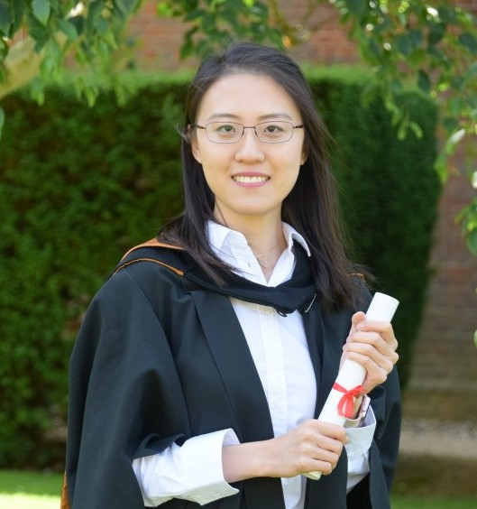

## About me:
My first name is pronounced as "Sh-ih-ow Chi" (meaning jade born at dawn in Chinese), but  feel free to call me Shirley!

I am a 4th-year [PhD student](http://www.eng.cam.ac.uk/profiles/xl394)  at the University of Cambridge \
with [Professor Ramji Venkataramanan](https://rv285.github.io/), studying **information theory** and **statistical learning**.  Specifically, my doctoral research focuses on applying coding theory for **efficient data storage and inference**, in response to the pressing need for these in the era of big data. In spring 2023, I interned at \
Microsoft Research Cambridge, working on error correction codes for [Project Silica](https://www.microsoft.com/en-us/research/project/project-silica/), which is one of the most ambitious and longest-running projects at Microsoft, aiming to revolutionise today's cloud data storage systems.

I'm part of the [Signal Processing and Communications Group](https://sigproc.eng.cam.ac.uk/) in the [Information Engineering Division](http://www.eng.cam.ac.uk/research/academic-divisions/information-engineering) of the Engineering Department. 
My PhD is supported in part by a Schlumberger Cambridge International Scholarship funded by the [Cambridge Trust](https://www.cambridgetrust.org/). Prior to my PhD, I obtained my BA and MEng (with distinction) in Information and Computer Engineering from Cambridge in 2019. 

I have lived, studied and thrived in **four cultures** (Chinese, British, Singaporean and American). My experience living overseas over the past nine years has nurtured my adaptability and open-mindedness. I'm always curious to learn and understand more about people whose cultural backgrounds, experiences and perspectives are different from my own. Although I'm introverted, I have a warm personality and a strong sense of empathy; through my leadership roles (e.g. postgrad representative), I work to bring people together and foster connections within my community. 

Besides work, I'm a sports lover and a half-marathon runner. I play badminton, table tennis, squash or tennis regularly with friends and labmates. As part of the [Cambridge Dancers' Club](https://www.cambridgedancers.org/), I've also recently fallen in love with Rock 'n' Roll as a fun, energetic dance style. To me, keeping an active lifestyle is refreshing and invigorating!

## Get in touch:
Shirley Xiaoqi Liu\
Signal Processing and Communications Group\
Department of Engineering\
University of Cambridge\
Trumpington Street, Cambridge CB2 1PZ, UK

**Email**: xl394 [at] cam.ac.uk\
**Office**: BN3-03