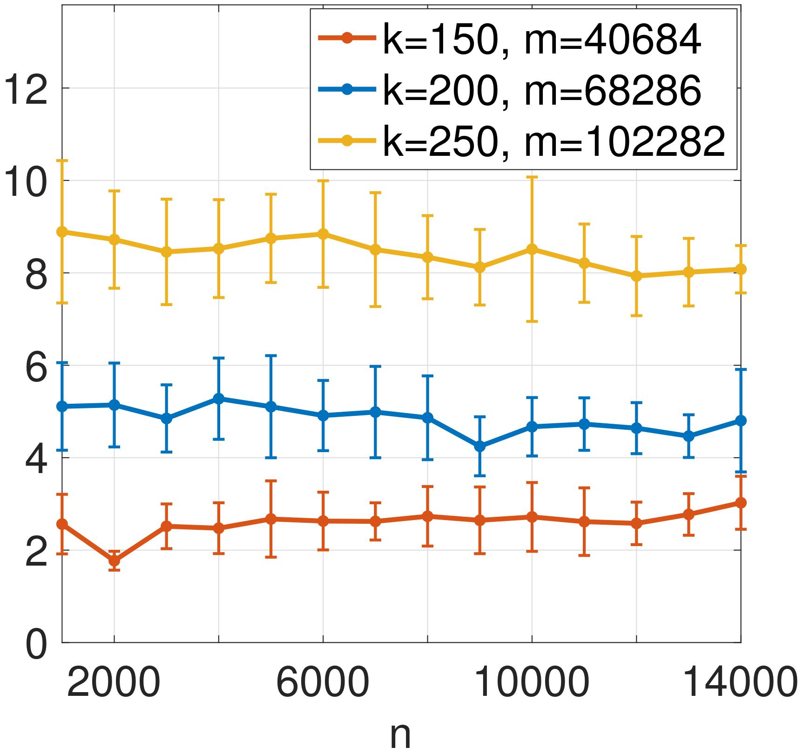

<h1 style="font-size:30px">Research</h1>

My research focus lies in [**information theory**](https://en.wikipedia.org/wiki/Information_theory), [**coding theory**](https://en.wikipedia.org/wiki/Coding_theory#:~:text=Coding%20theory%20is%20the%20study,data%20transmission%20and%20data%20storage.), and [**statistical learning**](https://en.wikipedia.org/wiki/Statistical_learning_theory). 
Specifically, I am interested in applying tools from information theory and coding theory to (high-dimensional) statistical inference problems such as  compressed sensing, low-rank matrix estimation, change points detection and communications across multiple access channels. 
An emphasis of my research has been to develop fast  algorithms for these inference problems, and provide mathematical guarantees on their performance (in terms of certain error metrics, or memory and time complexties). 

I've been particularly interested in studying **message passing algorithms** for the inference problems mentioned above. There, we represent the statistical relationships between variables in the problem by a sparse or dense factor graph; the algorithm then iteratively updates estimates of the variables by passing messages along the graph edges. (Chapter 2 of [*Modern Coding Theory*](https://www.mathematik.uni-muenchen.de/~kpanagio/ModernCodingTheory/mct-new.pdf) contains a nice  introduction to   message passing.)

I review papers for International Symposium on Information Theory (ISIT) and International Symposium on Topics in Coding (ISTC).

## Key words:
- Low density parity check (LDPC) codes/ sparse graph codes
- Message passing algorithms (on sparse or dense graphs), [Approximate Message Passing (AMP)](https://ieeexplore.ieee.org/document/9785928)
- Compressed sensing/ sparse recovery
- Combinatorial analysis
- Multiple access channels
- Change points detection

## Publication:
My recent paper titled [**"Sketching sparse low-rank matrices with near-optimal sample- and time-complexity using message passing"**](https://ieeexplore.ieee.org/document/10120641/) was accepted to appear in [IEEE Transactions on Information Theory](https://ieeexplore.ieee.org/xpl/aboutJournal.jsp?punumber=18). Consider n-by-n matrices with singular vectors each containing at most k  n non-zero entries.  In this paper, we proposed an algorithm based on coding theory and message passing that  can recover a sparse, low-rank matrix with O(k2) sample complexity and O(k3) runtime instead of the O(polylog(n)) and O(poly(n)) required by most existing state-of-the-art algorithms.  The shorter version of this paper has been presented at [IEEE International Symposium on Information Theory 2022 (ISIT)](https://www.isit2022.org/). Here are <a href="/ISIT_talk_Shirley_Liu_website_version.pdf">my slides</a>.

Bipartite graphs like the one on the left are used to illustrate and analyse our proposed message passing algorithm. 

The figure on the right is excerpted from the paper, which plots the runtime of the algorithm in simulations against the ambient dimension n of the matrix, for different sparsity levels k. As we can see, the runtime only scales with k and is independent from n. More details including a rigorous proof of this result can be found in the paper.

## Work in progress:
Currently I'm working on communications over **Gaussian Multiple Access Channels (GMAC)** with **random user activity**, where users are active in a sporadic and uncoordinated manner. This is particularly pertinent to Internet of Things (IoT) and machine-type communications. We propose an efficient coding scheme based on random linear models with Approximate Message Passing (AMP) decoding, and derive theoretical achievability and converse bounds to compare with our devised practical scheme.

Here's a [poster](ESIT_GMAC_poster_final.pdf) about this work that I presented at the [IEEE European School of Information Theory 2023 (ESIT)](https://www.bristol.ac.uk/maths/events/2023/esit-2023.html).

