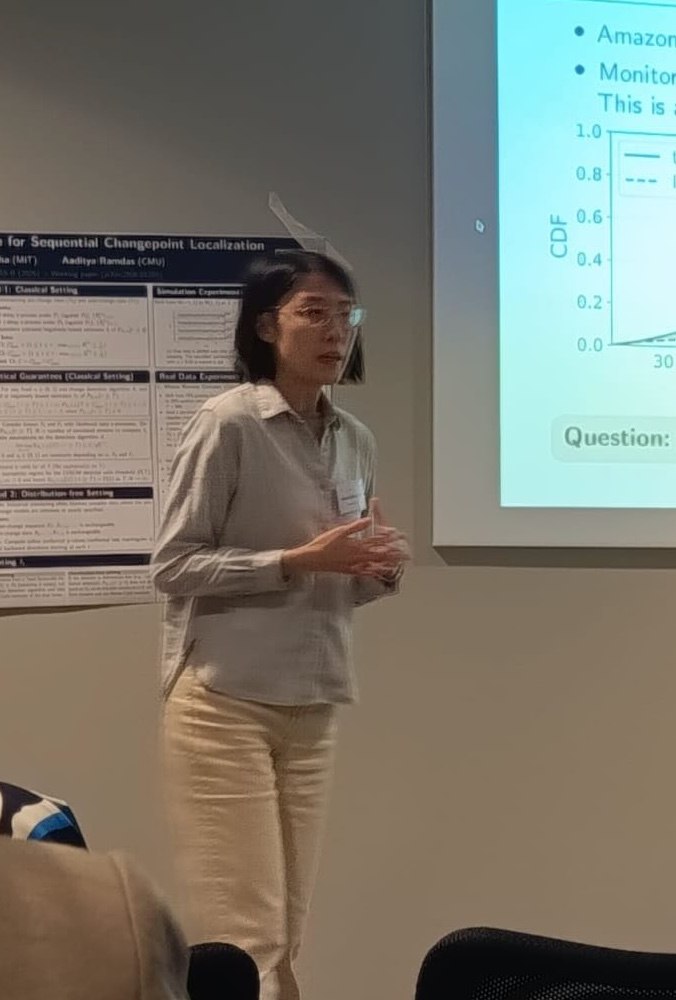

<h1 style="font-size:30px">Research</h1>

Empirical advances in machine learning have outpaced our theoretical understanding, leaving open central questions about when, why, and how modern machine learning systems work. My research aims to develop statistical and information-theoretic foundations for machine learning that help address these questions to inform systems design that are both efficient and reliable. A recurring theme of my research is learning with heterogeneous data since real-world data varies across time, latent groups, and problem instances, violating the stationarity and homogeneity assumptions on which much of classical theory rests.

Drawing on statistics, optimisation, and information theory, my recent and ongoing work is organised around three inter-connected threads: 

▶ <strong>Training dynamics of canonical statistical & machine learning models</strong> 

A key question in learning theory is how the model class and training procedure jointly determine the learned solution  and its generalisation properties. Current theory, both asymptotic and finite-sample,  extends primarily to  canonical models such as  Gaussian mixtures and multi-index models (i.e., two-layer neural networks), since precise analyses are  demanding  even in these cases. Nevertheless, such analyses  have *repeatedly* sharpened  our understanding of phenomena including   early stopping, benign overfitting, and feature learning, and informed  more efficient design  of models and training procedures. Two of my recent and ongoing projects contribute to this area.

▶ <strong>Sequential decision-making on heterogeneous data</strong>

Sequential decision-making arises  wherever actions must be taken one at a time, often with only partial information. A doctor assigns a treatment and sees its effect, but never observes what the alternative treatments would have achieved. An inference pipeline escalates a query through increasingly costly models, deciding at each stage whether to answer or defer; whether the cheaper model would have sufficed is revealed only after paying for the costlier ones. What makes such problems hard is that the information needed to act optimally is *unavailable* at the time of action, so practical systems rely heavily on heuristics. My work develops procedures with provable optimality guarantees that can inform or supersede heuristics.

▶ <strong>Uncertainty quantification under weak  distributional assumptions</strong> 

Quantifying uncertainty is relatively straightforward when the model is well-specified and much harder otherwise. My ongoing research asks what can *still* be certified when the usual distributional assumptions are withdrawn. The main tools I use are e-values and e-processes, conformal prediction, and prediction-powered inference, which together deliver inference that remains valid at arbitrary, data-dependent  sample sizes, under  minimal data distributional assumptions.

\
During my PhD, I focused on message passing algorithms for high-dimensional statistical estimation and inference: a family of computationally efficient, iterative algorithms that provably achieve statistical optimality across a range of problems. I applied these to changepoint localisation, sketching sparse low-rank matrices, and reliable coding and decoding schemes for communication in large user networks.
 
## Interests:
- **Training dynamics:** early stopping of gradient descent, benign overfitting, feature learning. 
- **First-order optimisation methods:** gradient descent, approximate message passing
- **Sequential decision-making:** bandits, online learning, adaptive inference
- **Uncertainty quantification:** e-values, conformal prediction, prediction-powered inference
- **Information theory and communication systems**

## Get in touch:
I've come to realise that clear thinking and clear presentation strengthen each other, so I spend a lot of time structuring and crafting my papers and talks. Most papers below are accompanied with **talk slides**, which give a more visual and high-level explanation of the same technical ideas. If anything is unclear, please  get in touch: I'm always glad to explain further, and questions often show me where the presentation could be improved. :)

## Selected preprints & publications:

1. A. Buna, **S.X. Liu**, P. Rebeschini, "[Minimax Optimal Early-Stopped Gradient Descent for Gaussian Mixture Classification](https://arxiv.org/abs/2608.06250)", *in submission*, 2026. ([talk](talk_on_early_stopped_GD(10mins).pdf))
2. **X. Liu**, D. Baudry, J. Zimmert, P. Rebeschini, A. Akhavan, "[Non-stationary Bandit Convex Optimization: A Comprehensive Study](https://arxiv.org/abs/2506.02980)", *Proceedings of the 39th Annual Conference on Neural Information Processing Systems*, 2025. ([talk](CDT_bandits_talk(20mins).pdf), [poster](neurips_poster_bandits.pdf))
3. In alphabetical order: J. Allison, P. Anderson, E. Aranas, Y. Assaf, M. Caballero, J. Chattaway, A Chatzieleftheriou, J. Clegg, B. Cooper, T. Deegan, A. Donnelly, R. Drevinskas, C. Gkantsidis, A. G. Diaz, I. Haller, F. Hong, T. Ilieva, R. Joyce, V. Kapitany, W. Kunkel, D. Lara, T. Lawson, S. Legtchenko, F. Liu, **X. Liu**, B. Magalhaes, S. Nowozin, H. Overweg, A. Rowstron, M. Sakakura, N. Schreiner, A. Smith, O. Snowdon, I. Stefanovici, D. Sweeney, G. Verkes, P. Wainman, C. Whittaker, P. W. Berenguer, H. Williams, T. Winkler, S. Winzeck, R. Black, B. Canakci, D. Cletheroe, Z. Feng, "[Laser writing in glass for dense, fast and efficient archival data storage](https://www.nature.com/articles/s41586-025-10042-w)", *Nature*, 650, 606–612, 2026.
4. **X. Liu**, P. Pascual Cobo and R. Venkataramanan, "[Many-user multiple access with random user activity: achievability bounds and efficient schemes](https://ieeexplore.ieee.org/document/11206438)", *IEEE Transactions on Information Theory*, vol. 72, no. 1, pp. 383-414, Jan. 2026, doi: 10.1109/TIT.2025.3622969. ([conference version](https://ieeexplore.ieee.org/abstract/document/10619669), [talk](RA_isit2024(17mins).pdf), [poster](ESIT_GMAC_poster_final.pdf))
5. **X. Liu**, K. Hsieh and R. Venkataramanan, "[Coded many-user multiple access via Approximate Messsage Passing](https://arxiv.org/abs/2402.05625)", to appear in *Information Theory, Probability and Statistical Learning: A Festschrift in Honor of Andrew Barron*, 2025. ([conference version](https://ieeexplore.ieee.org/abstract/document/10619478), [talk](CDMA_isit2024(17mins).pdf))
6. **X. Liu**, "[Message Passing Algorithms for Statistical Estimation and Communication](https://doi.org/10.17863/CAM.112616)", PhD thesis, Apollo-University of Cambridge Repository, 2024.
7. G. Arpino, **X. Liu**, J. Gontarek and R. Venkataramanan, "[Inferring Change Points in High-Dimensional Regression via Approximate Message Passing](https://arxiv.org/abs/2404.07864)", *Journal of Machine Learning Research*, 26(225), pp.1-49, 2025.
8. G. Arpino, **X. Liu** and R. Venkataramanan, "[Inferring Change Points in High-Dimensional Linear Regression via Approximate Message Passing](https://proceedings.mlr.press/v235/arpino24a.html)", *Proceedings of the 41st International Conference on Machine Learning*, PMLR 235:1841-1864, 2024. ([talk](changepoint_ICML_slides.pdf), [poster](changepoints_poster.pdf), [code](https://github.com/gabrielarpino/AMP_chgpt_lin_reg))
9. **X. Liu** and R. Venkataramanan, "[Sketching Sparse Low-Rank Matrices With Near-Optimal Sample- and Time-Complexity Using Message Passing](https://ieeexplore.ieee.org/document/10120641)", *IEEE Transactions on Information Theory*, vol. 69, no. 9, pp. 6071-6097, Sept. 2023, doi: 10.1109/TIT.2023.3273181. ([conference version](https://ieeexplore.ieee.org/document/9834693)) 

## Selected talks:
 
1. Upcoming: *Statistics Seminar*, School of Mathematics, University of Bristol, Oct 2026.
2. "Bayes-Assisted Confidence Sequences for CDFs", *Safe Anytime-Valid Inference (SAVI) Conference*, University of Twente, Jul 2026.
3. ["Mind the U Curve: Why We Stop Gradient Descent Early"](talk_on_early_stopped_GD(10mins).pdf), *Meet Our Group Seminar Series*, Department of Statistics, University of Oxford, May 2026.
4. ["Learning Under Non-Stationarity: Statistical Inference & Bandit Convex Optimization"](warwick_stats_seminar_final.pdf), *Algorithms and Computationally Intensive Inference Seminar*, Department of Statistics, University of Warwick, Mar 2026.
5. "[Tight Confidence Sequences From Universal Portfolio](Reading_group_talk_on_universal_portfolio.pdf)", *Hypothesis Testing with E-values Reading Group*, Department of Statistics, University of Oxford, Mar 2026.
6. "[Non-Stationary Bandit Convex Optimization: Algorithms and Links to Coin Betting](CDT_bandits_talk(20mins).pdf)", *Algorithmic Statistics Workshop*, Department of Statistics, University of Oxford, Nov 2025.
7. "[Tutorial on Sequential Anytime-Valid Inference Using E-processes](SAVI_tutorial_shirley.pdf)", *Statistics in AI CDT Module*, Department of Statistics, University of Oxford, Nov 2025.
8. "[Sequential Anytime-Valid Inference Using E-processes](Ramdas_Wang_ebook_chapter7-2.pdf)", *Hypothesis Testing with E-values Reading Group*, Department of Statistics, University of Oxford, Oct 2025.)
9. "[Loss landscapes and optimizaton in over-parameterized non-linear systems and neural networks](learning_theory_reading_group.pdf) ", *Learning Theory and Statistical Optimization Reading Group*, Department of Statistics, University of Oxford, Nov 2024.
10. ["Communication over many-user channels via Approximate Message Passing"](IT_seminar_GMAC_220524_github.pdf), *Information Theory Seminar*, Department of Mathematics, University of Cambridge, May 2024.

## Service:
I review papers for several conferences and journals including the Conference on Neural Information Processing Systems (NeurIPS) (top reviewer 2024), International Conference on Machine Learning (ICML), Transactions on Machine Learning Research (TMLR), and International Symposium on Information Theory (ISIT).