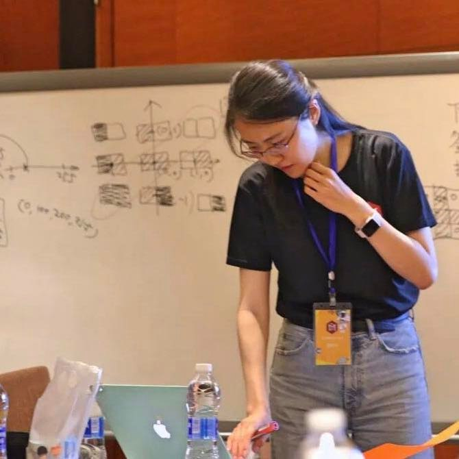

<h1 style="font-size:30px">Teaching</h1>

From primary school to university, I've been fortunate to have met and known many great teachers and mentors. They are authentic, generous and empathetic, with admirable work ethic and genuine love for their work.  These people have profoundly influenced me and sparked my passion for teaching and outreach.

Over the past five years, I have participated in numerous teaching and outreach activities. Through these, I enjoyed sharing my enthusiasm for Information Theory (or Electrical and Information Engineering at large) with younger students; by endeavouring to unpack complicated topics in an easy-going yet rigorous way, I also developed new insights into the subject matter. I hope to make helping and inspiring more undergraduate and secondary students  a recurring theme of my career.

## Selected teaching & outreach experience:

- Teaching assistant (supervisor) for third-year undergraduate courses [3F7 Information Theory & Coding](http://teaching.eng.cam.ac.uk/content/engineering-tripos-part-iia-3f7-information-theory-and-coding-2021-22) and [3F4 Data Transmission](http://teaching.eng.cam.ac.uk/content/engineering-tripos-part-iia-3f4-data-transmission-2019-20)
- Demonstrator for 3F4 Data Transmission laboratory
- Teaching assistant for Electronic & Information Engineering Track at Cambridge AI+ Programme
- Project leader at the 2019 Micro Distance International Youth Forum
- Volunteer at [Cambridge Hands-On Science (CHaOS)](https://chaosscience.org.uk/)
- [STIMULUS](https://stimulus.maths.org/content/stimulus-cambridge-university-students-volunteering-local-schools) volunteer for A level maths
